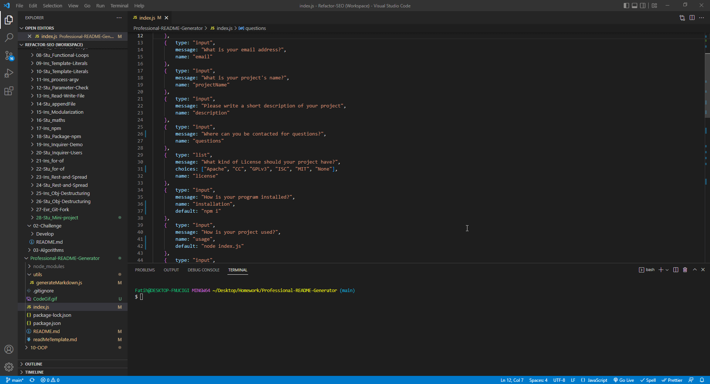

# Professional-README-Generator
  
  ## License
  This application is covered under the CC  https://creativecommons.org/licenses/by/2.0/legalcode

  ## Description
  
  a simple program to help make a more professional looking readme

  
  
  ## Table of Contents
  
  - [License](#license)
  - [Installation](#installation)
  - [Usage](#usage)
  - [More Info](#more-info)
  - [How to Contribute](#how-to-contribute)
  - [Tests](#tests)
  - [Questions](#questions)
  - [Contact Info](#contact-info)
  
  
  ## Installation
  
  To install the programs you'll need you've got to run these commands.
  ~~~
  npm i
  
  npm i inquirer@8.2.4
  ~~~
  
  ## Usage
  
  To run the program you've got to use the command:
  ~~~
  node index.js
  ~~~
  ---
  
  ## More Info
  
  you'll be asked to enter information to be entered at different sections of the readme
  
  ## How to Contribute
  
  To help contribute to this project, contact me over at fatih9720@hotmail.com!
  
  ## Tests
  
  To run tests
  ~~~
  npm test
  ~~~
  
  ## Questions
  
  If you have any questions contact me at fatih9720@hotmail.com
  
  ## Contact Info
  
  - You can find more of my work over here https://github.com/FatihSul
  
  - For anything else contact me at fatih9720@hotmail.com
  
